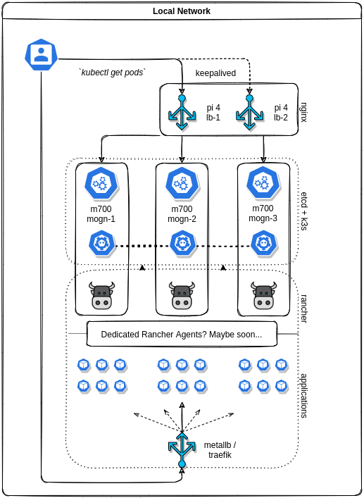

# mogn-infra
 
Homelab cluster automation playbooks.

Configures and spins up a highly available* [etcd](https://etcd.io/), [k3s](https://k3s.io/), [rancher](https://rancher.com/products/rancher/) cluster based on an arbitrary number of nodes.

**assuming a minimum of 2 server nodes and 2 load balancers*
 
 

 
 
*not visualized: a rancher / k3s agent role is available, I just don't have any in my cluster yet*

## Requirements

- a control node
    - [Ansible](https://docs.ansible.com/ansible/latest/installation_guide/intro_installation.html) installed
    - [cfssl](https://github.com/cloudflare/cfssl) installed (used to generate certs)
    - [helm](https://helm.sh/docs/intro/install/) installed
    - ssh access to the host nodes
- 1+ server / agent node
- *optional:* 1+ external load balancer node, otherwise [traefik](https://doc.traefik.io/traefik/) will be used internally (ships with k3s)
- a `hosts` file:
    
        [servers]
        node-1 ip=<node-1-ip>
        node-2 ip=<node-2-ip>
        node-3 ip=<node-3-ip>

        [agents] <- optional
        node-4 ip=<node-4-ip>

        [loadbalancers] <- optional
        lb-1 ip=<lb-1-ip>
        lb-2 ip=<lb-2-ip>
- a `vars/env.yml` file:

        ---

        K3S_TOKEN: "<CUSTOM_TOKEN>"
        DNS_NAME: "<CUSTOM_DNS_NAME>"
        VIRTUAL_IP: "<CUSTOM_VIRTUAL_IP>"
        KEEPALIVED_PASSWORD: "<CUSTOM_PASSWORD>"
        
     A template for these files can be created with `ansible-playbook init.yml`
 

## Running the playbook(s)
 

### Initialize `hosts` and `vars/env.yml` files (optional): 

 
  
    ansible-playbook init.yml

Don't forget to update the values to fit your cluster.

_---_

### Main provisioning playbook:

 

    ansible-playbook provision.yml

 

*The default behavior of `provision.yml` is to run the `kubectl.yml` playbook at the end which copies and adds the kubeconfig to the local control node for access to the cluster. If you would like to skip this step append `-e nokubectl=True` to the command e.g:*

    ansible-playbook provision.yml -e nokubectl=True
 

## Verifying the cluster
 

    source ~/.profile
    
    kubectl get nodes
 

Create a DNS record or /etc/hosts entry for the load balancer or one of the rancher servers if you didn't set any up. Browse to the `DNS_NAME` url (e.g `rancher.mogn.co`) that you set in the `vars/env.yml` file and you should see the Rancher welcome screen.
 
 

## ROADMAP

- *Part 0 (?) - PXE boot*

- ~~Part 1 - HA etcd~~
    - merged with [3e3fea6](https://github.com/semoog/mogn-infra/commit/3e3fea6ae2b58a9b43c9fb29cf19efe2f1a7177e)

- ~~Part 2 - HA k3s~~
    - merged with [PR - k3s roles](https://github.com/semoog/mogn-infra/pull/1)

- ~~Part 3 - HA rancher~~
    - merged with [PR - rancher role](https://github.com/semoog/mogn-infra/pull/2)

- ~~Part 4 - nginx rancher load balancer~~
    - merged with [PR - nginx lb](https://github.com/semoog/mogn-infra/pull/3)
    - keepalived HA merged with [PR - keepalived](https://github.com/semoog/mogn-infra/pull/4)

- Part 5 - TLS

- Part 6 - traefik / metallb application load balancer
